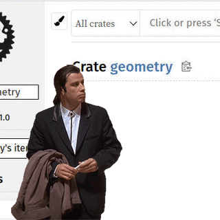
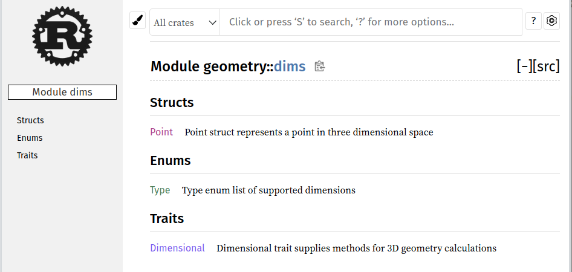
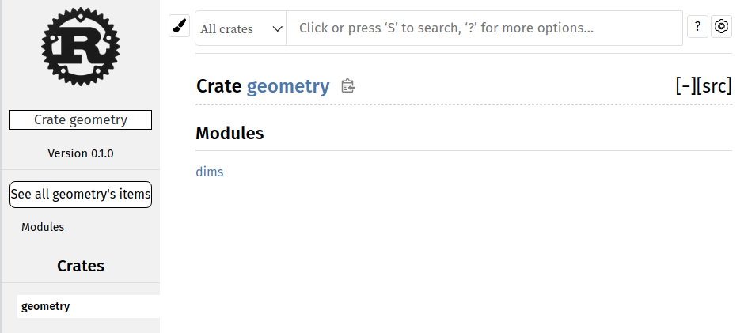
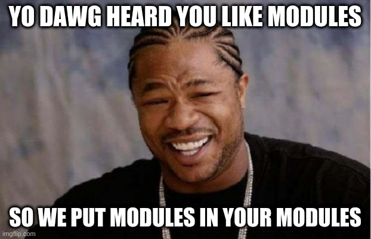
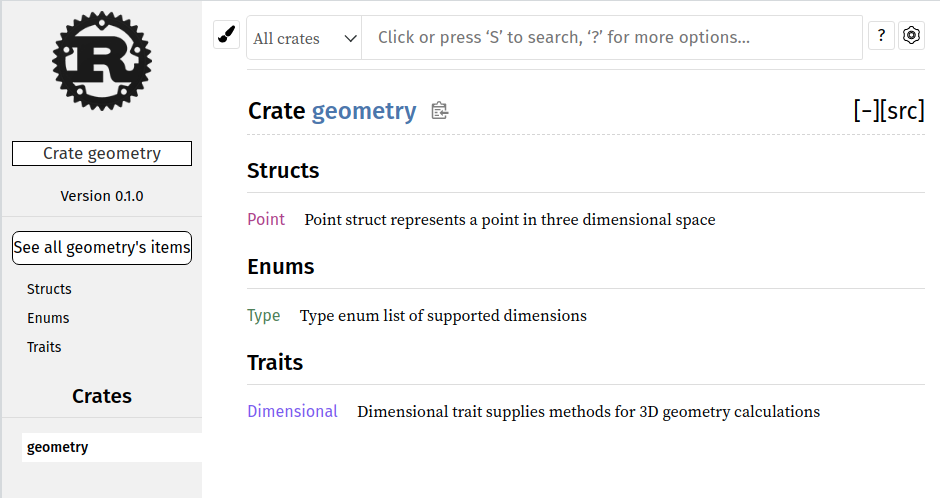
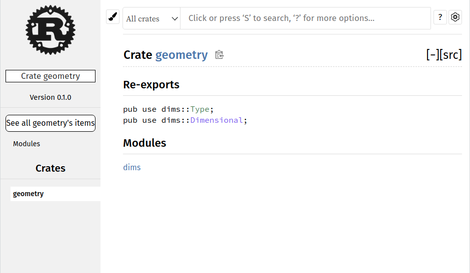

# Rust modules explained


As I was learning Rust, I was created a project that used multiple libraries and I kept running into exceptions that I could not explain and I had a lot of confusion. I wanted to write something to document my misunderstandings and provide a solution that can be copied for your benefit and maybe increase your understanding. 

## References
The documentation on modules and various stack overflow questions and answers led me to believe that adding submodules and re-exporting them should be possible and easy.
* [Rust Book](https://doc.rust-lang.org/book/ch07-00-managing-growing-projects-with-packages-crates-and-modules.html)
* [Rust by Example - Modules](https://doc.rust-lang.org/stable/rust-by-example/mod.html)

# Setup
Create a scenario to demonstrate where misunderstandings of modules and errors are manifesting. The scenario is creating a library that called calls another local library. 
* Initialize the modules
  ```bash
  cargo init geometry --lib      # geometry provides common structs, enums, and traits
  cargo init triangles --lib     # triangles implements traits from geometry
  ```
* Added implementations. In this case, the triangles library is trying to use the geometry library so that it can implement traits and use enumerations.
  ```
  ./triangles/src/lib.rs
  ./geometry/src/lib.rs
  ./geometry/src/dims.rs
  ```
## Referencing a local library from another local library
One of the challenges was getting a local library reference in another local library. To solve this I needed to use a path in the Cargo.toml
`triangles/Cargo.toml`
```toml
[package]
name = "triangles"
version = "0.1.0"
edition = "2018"

[dependencies]
geometry = { path = "../geometry" }
```

# Failures
A common failure when developing a library is the `not found in` or `cannont find` errors. I was able to run `cargo build` and `cargo test` without any compilation errors for the geometry library. I then tried to use the geometry module in the triangles library, but I was unable to `use` the traits and enumerations. This resulted in errors like the following:
  ```
  ./triangles$ cargo clean
  ./triangles$ cargo build
     Compiling geometry v0.1.0 (/geometry)
     Compiling triangles v0.1.0 (/triangles)
      Finished dev [unoptimized + debuginfo] target(s) in 0.64s
  ./triangles$ cargo test
     Compiling triangles v0.1.0 (/triangles)

  error[E0405]: cannot find trait `Dimensional` in crate `geometry`
    --> src/lib.rs:14:20
     |
  14 |     impl geometry::Dimensional for Triangle {
     |                    ^^^^^^^^^^^ not found in `geometry`

  error[E0412]: cannot find type `Type` in crate `geometry`
    --> src/lib.rs:15:43
     |
  15 |         fn dimensions(&self) -> geometry::Type {
     |                                           ^^^^ not found in `geometry`
     |
  help: consider importing one of these items
     |
  4  |     use crate::triangles::geometry::dims::dims::Type;
     |
  4  |     use geometry::dims::dims::Type;
     |

  Some errors have detailed explanations: E0405, E0412, E0425.
  For more information about an error, try `rustc --explain E0405`.
  error: could not compile `triangles` due to 4 previous errors
  ```
## Investigating errors with documentation
The errors caused me a lot of confusion in the triangles library. I tried using many 'solutions' which didn't work as I was flailing around trying to fix it by modifying the `use` to prefix with `self::` or `crate::`. This was not the path to take. The correct path was to verify the the geometry module was defined correctly before trying to use it in another library. Fortunately, I discovered an easy way to check if things are exporting as expected is to view the documentation of the library.

```
cd ./geometry
cargo doc --open
```

# Smells and Solutions
## Smell: Empty Documentation
**Smell**: The documentation is completely empty. In this scenario the `src\lib.js` was empty. My misunderstanding was that you can have an empty `lib.js` and another module `./geometry/src/dims.rs` would work.



### Solution 1a: Move the contents to `lib.rs`
The easiest path forward, is to copy the contents of `geometry/src/dims.rs` to `geometry/src/lib.rs` and then delete `geometry/src/dims.rs`.

### Solution 1b: Add [lib] to `Cargo.toml`
If you like things named explicitly, add a `[lib]` section to the `Cargo.toml` to override the default `lib.rs` name. [Configuring [lib]](https://doc.rust-lang.org/cargo/reference/cargo-targets.html#configuring-a-target)
```
[lib]
name = "geometry"
path = "src/dims.rs"
```


Now the submodule `geometry::dims` can be used in `triangles` library, e.g. `use geometry::dims::{Type,Dimensional};`

## Smell: Module defined in a module
**Smell** I have a module defined in my module and that is not the behavior I wanted. When you look at the documentation modules are defined but I expected my structs, enums, and traits at the root level.





### Solution 2: Delete `pub mod`
A library project uses `[package] name` in the `Cargo.toml` to be the name of the crate in the documentation and publishes the contents of `src\lib.rs`. Remove the `pub mod` structure inside of the `src\lib.rs` to remove the extra module definition.



Now the submodule `geometry` can be used in `triangles` library, e.g. `use geometry::{Type,Dimensional};`

## Smell: Organization is hard
**Smell**: I want to keep my code separated into files so that it is manageable, but when I export my library I want the API to be flat for the end users.


### Solution 3: Re-export
Re-exporting allows you to organize your code into multiple files but have it exposed as a single unified API. 
* The files are separated and there are separate modules.
```
drwxr-xr-x 2 4096 Sep 25 12:36 ./
drwxr-xr-x 4 4096 Sep 25 09:08 ../
-rw-r--r-- 1  356 Sep 25 12:58 dims.rs
-rw-r--r-- 1   31 Sep 25 12:51 lib.rs
```
* The `geometry/src/lib.rs` is only reexporting the API it wants for the geometry library
```rust
pub mod dims;
pub use dims::{Type,Dimensional};
```



The display doesn't look as nice as when you re-export, but the behavior works the same. The submodule `geometry` can be used in `triangles` library, e.g. `use geometry::{Type,Dimensional};` even though `Type` and `Definition` are in the dims module
